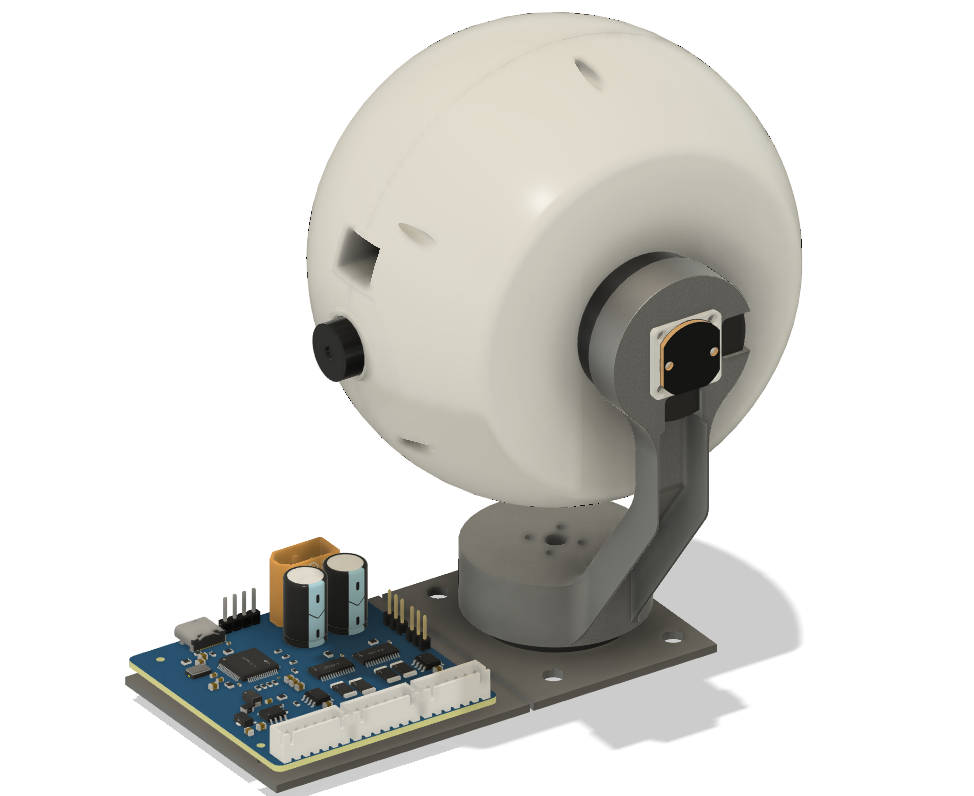
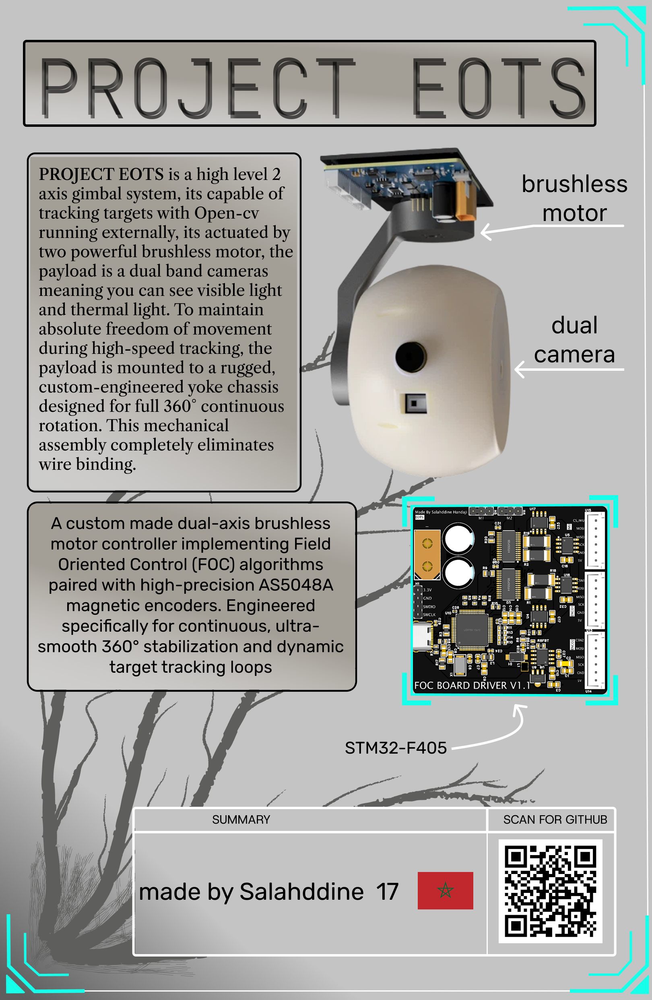
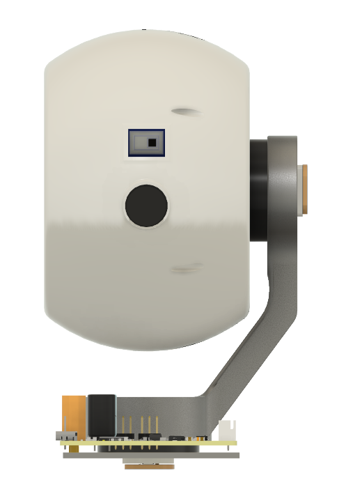
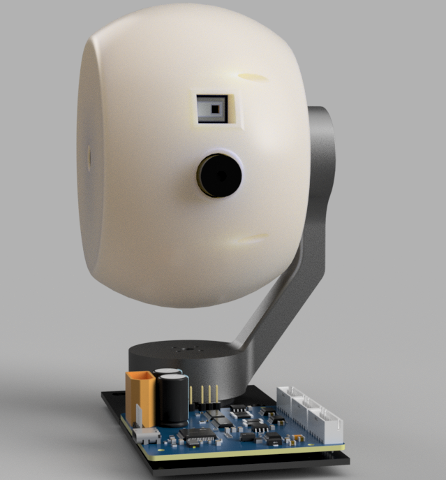

# Project EOTS: Dual-Axis FOC Gimbal

Ever wanted a camera system that can track anything say drones, planes, or cars? Introducing a high-precision, from-scratch Electro-Optical Targeting System (EOTS). Built with Field Oriented Control (FOC) for continuous, high-torque stabilization, it features a dual-camera sensor payload for synchronized thermal tracking and optical zoom.

- [Project EOTS: Dual-Axis FOC Gimbal](#project-eots-dual-axis-foc-gimbal)
- [Core System Architecture](#core-system-architecture)
  - [Embedded Control & Power Distribution](#embedded-control--power-distribution)
  - [Mechatronics & Actuation](#mechatronics--actuation)
  - [Optical Payload](#optical-payload)
- [(BOM)](#hardware-manifesto-bom)

---

# Core System Architecture

The custom 4-layer control board isolates high-frequency digital lines from high-current motor return paths to preserve analog signal integrity. 

## Embedded Control & Power Distribution
* **Microcontroller:** STM32F405RGT6 running custom embedded FOC loops.
* **Gate Drivers:** Dual DRV8313 triple half-bridge drivers managing motor phase currents.
* **Interconnects:** 6-pin JST-XH vertical locking headers (B6B-XH-A) route encoder inputs directly into the MCU timers.
* **Power Delivery:** Main system power is distributed via a high-amperage XT60 connector.

## Mechatronics & Actuation
The mechanical assembly routes power and signals through continuous rotational axes without tangling internal wiring.
* **Actuators:** Dual 2804 100KV brushless motors hard-mounted directly to the structural yoke arms.
* **Sensor Fusion:** An MPU9250 IMU tracks high-speed orientation dynamics in real-time.
* **Feedback Loop:** AS5048A magnetic rotary encoders paired with shaft-mounted diametric neodymium magnets handle absolute angular tracking down to 14-bit resolution.
* **Slip Ring Integration:** A 12-channel MSC-22-12 high-speed capsule slip ring passes continuous USB-C video data through the rotating non-motor pivot arm.
* **Metal chassis** Metal 3D Printed arm to provide more than enough stability and rigidity.  

## Optical Payload
The sealed sphere housing protects a dual-sensor array running image processing loops back to a central hub.
* **Primary Optical:** IMX219 high-resolution camera module for target detection and optical zoom tracking.
* **Thermal Matrix:** AMG8833 8x8 infrared thermopile array for long-wave thermal signature targeting.
* **Processing Unit:** Raspberry Pi Zero 2 W handles localized video streaming, telemetry generation, and targeting overlays.

---

# Bill of Materials (BOM)

| Components | Quantity | Price (dh) | Description |
|:---|:---:|:---|:---|
| 2804 100KV Brushless Motors | 2 | 345.42 | Actuators |
| FOC custom pcb | 1 | 1500 | pcb 5 pcba 2 |
| AS5048A | 2 | 194 | Magnetic Encoders magnet included |
| MPU9250 | 1 | OWNED | IMU |
| IMX 219 | 1 | 154.29 | CAMERA |
| AMG8833 | 1 | 218 | thermal camera |
| Raspberry Pi Zero 2 W | 1 | 300 | receive camera feeds |
| Slip ring | 1 | 87.83 | 12wire slip ring |
| custom chassis | 1 | 400 | metal 3d printed yoke |
| 3d print shipping fee | 1 | 300 | 3d printing legion fee |
| M2/M2.5/M3 screws kit | 1 | 218 | 625pcs kit |
| JST-XH | 5 | 53.3 | connectors |

### Budget Summary
* **Total Cost:** `3,770.84 dh`
* **Total in USD :** `~$407.30 USD`

# PICS 
## zine 

## renders 

