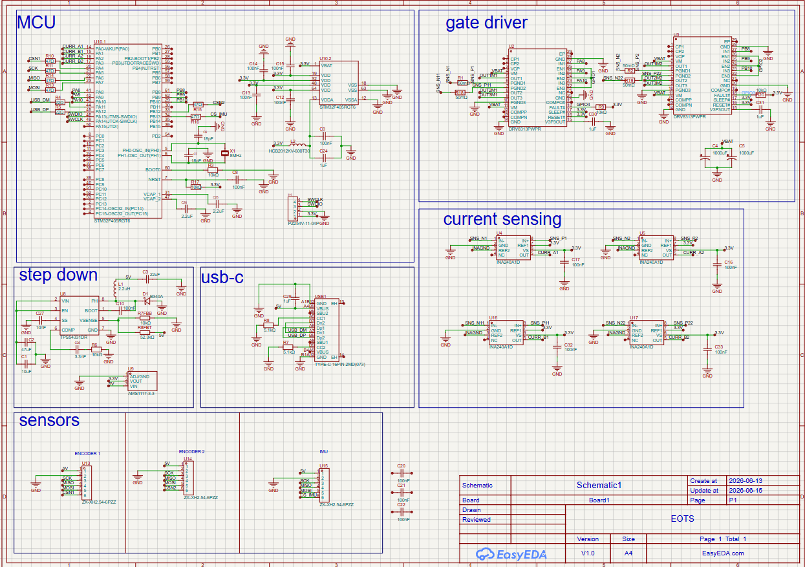
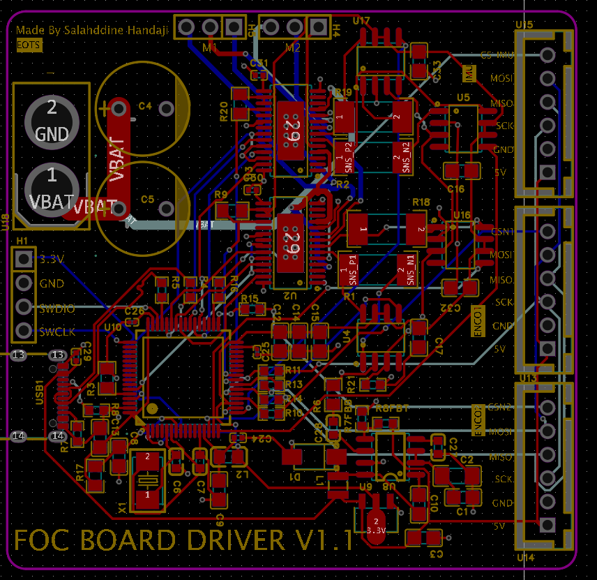
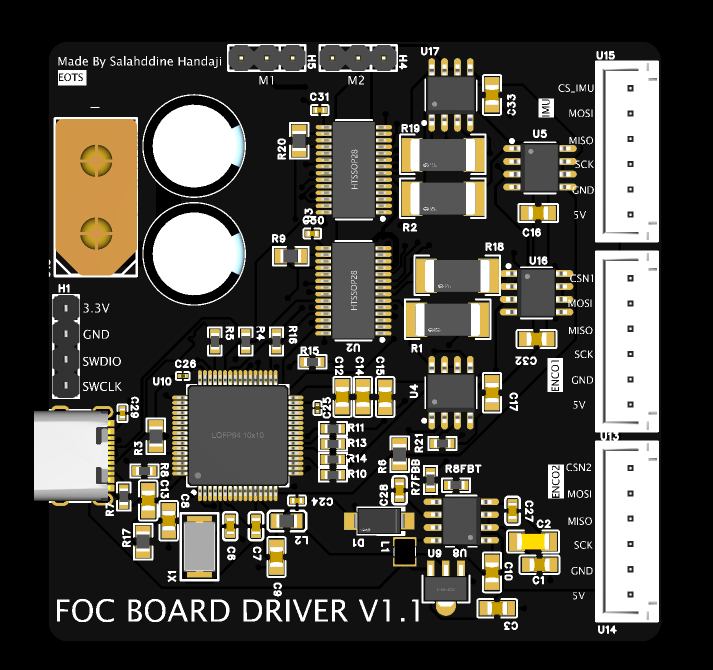
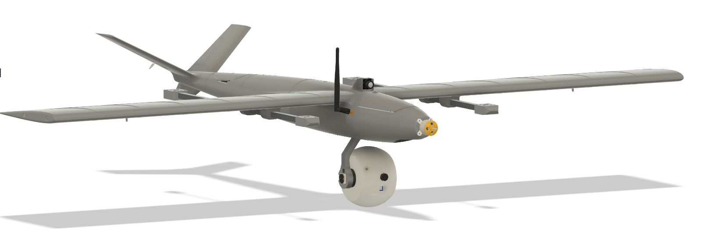

# Project EOTS: Dual-Axis FOC Gimbal


# Why did i make it

Ever wanted a camera system that can track anything say drones, planes, or cars? Introducing a high-precision, from-scratch Electro-Optical Targeting System (EOTS). Built with Field Oriented Control (FOC) for continuous, high-torque stabilization, it features a dual-camera sensor payload for synchronized thermal tracking and optical zoom.

- [Project EOTS: Dual-Axis FOC Gimbal](#project-eots-dual-axis-foc-gimbal)
- [Core System Architecture](#core-system-architecture)
  - [Embedded Control & Power Distribution](#embedded-control--power-distribution)
  - [Mechatronics & Actuation](#mechatronics--actuation)
  - [Optical Payload](#optical-payload)
- [(BOM)](#hardware-manifesto-bom)

---

##  Repository Structure

```text
Project-EOTS/
├── README.md                      
├── BOM.csv                        
├── zine.pdf                       
│
├── PCB/                     
│   ├── gerbers.zip                
│   ├── eots_schematic.json     
│   └── BOM.csv
│
├── CAD/                    
│   ├── eots.F3z       
│   ├── 3d printables    
│   └── PickAndPlace.csv
│
└── Firmware/                      
    ├── FOC_Gimbal_Driver_STM32/   
    │   ├── main.cpp              
    │   └── platformio.ini         
    │
    ├── RPi_Zero2W_Camera_Server/  
    │   ├── stream_server.py      
    │   └── requirements.txt       
    │
    └── Ground_Control_Station/    
        ├── main.py                
        ├── tracking.py            
        └── hud_display.py
```

# Core System Architecture

The custom 4-layer control board isolates high-frequency digital lines from high-current motor return paths to preserve analog signal integrity. 

## Embedded Control & Power Distribution
* **Microcontroller:** STM32F405RGT6 running custom embedded FOC loops.
* **Gate Drivers:** Dual DRV8313 triple half-bridge drivers managing motor phase currents.
* **Interconnects:** 6-pin JST-XH vertical locking headers (B6B-XH-A) route encoder inputs directly into the MCU timers.
* **Power Delivery:** Main system power is distributed via a high-amperage XT60 connector.
### Schematics 

### Layout

### 3D render

## Mechatronics & Actuation
The mechanical assembly routes power and signals through continuous rotational axes without tangling internal wiring.
* **Actuators:** Dual 2804 100KV brushless motors hard-mounted directly to the structural yoke arms.
* **Sensor Fusion:** An MPU9250 IMU tracks high-speed orientation dynamics in real-time.
* **Feedback Loop:** AS5048A magnetic rotary encoders paired with shaft-mounted diametric neodymium magnets handle absolute angular tracking down to 14-bit resolution.
* **Slip Ring Integration:** A 12-channel MSC-22-12 high-speed capsule slip ring passes continuous USB-C video data through the rotating non-motor pivot arm.
* **Metal chassis** Metal 3D Printed arm to provide more than enough stability and rigidity.  

## Optical Payload
The sealed sphere housing protects a dual-sensor array running image processing loops back to a central hub.
* **Primary Optical:** IMX219 high-resolution camera module for target detection and optical zoom tracking.
* **Thermal Matrix:** AMG8833 8x8 infrared thermopile array for long-wave thermal signature targeting.
* **Processing Unit:** Raspberry Pi Zero 2 W handles localized video streaming, telemetry generation, and targeting overlays.
  
---

##  How to Use It

Follow these steps to set up, flash, assemble, and operate the EOTS gimbal:

### 1. Hardware Assembly & Mechanical Setup
* **Mount the Actuators:** Secure the two 2804 100KV brushless motors into their respective pan and tilt axis slots on the custom metal 3D-printed yoke chassis.
* **Route the Wiring:** Feed the motor and camera wiring through the center of the 12-wire slip ring to ensure the panning axis can rotate infinitely without binding or straining the cables.
* **Secure the Payload:** Mount the dual-camera housing (containing the IMX219 optical camera and AMG8833 thermal array) onto the tilt axis bracket, ensuring the AS5048A magnetic encoders align perfectly with the motor magnets for precise feedback.

### 2. Flashing the FOC Board Firmware
* **Connect to Power/Data:** Plug a USB-C data cable into the onboard port of the custom FOC driver board.
* **Compile & Flash:** Open the source code located in the `/Firmware` directory using your preferred IDE (e.g., VS Code with PlatformIO or Arduino IDE). Select the correct target MCU board and upload the firmware.
* **Calibrate Encoders:** Run the initial calibration routine embedded in the firmware to map the absolute zero-position of the AS5048A magnetic sensors relative to the brushless motor poles.

### 3. System Interconnect & Operation
* **Power Delivery:** Provide main system power via the dedicated power terminals on the custom PCB (ensure voltage matches your motor/driver design limits).
* **Establish Data Links:** Hook up the Raspberry Pi Zero 2 W to the camera payload feeds and connect its communication lines (UART/SPI) to the FOC driver board to transmit tracking adjustments.
* **Initiate Tracking:** Run your external tracking pipeline (such as an OpenCV script processing the video feed) to send real-time target coordinate errors to the gimbal, allowing the closed-loop FOC system to stabilize and lock onto the target.

---

# Bill of Materials (BOM)

| Components | Quantity | Price (dh) | Description |
|:---|:---:|:---|:---|
| 2804 100KV Brushless Mo | 2 | 345.42 | Actuators |
| FOC custom pcb | 1 | 1130.99 | Pcb 5 pcba 2 |
| AS5048A | 2 | 194 | Magnetic Encoders magnet included |
| MPU9250 | 1 | OWNED | IMU |
| IMX 219 | 1 | 154.29 | Camera |
| AMG8833 | 1 | 218 | Thermal camera |
| Raspberry Pi Zero 2 W | 1 | 280.00 | Receive camera feeds |
| Slip ring | 1 | 87.83 | 12 Wire slip ring |
| custom chassis | 1 | 296.03 | Metal 3d printed yoke |
| 3d print shipping fee | 1 | 300 | 3d printing legion fee |
| M2/M2.5/M3 screws kit | 1 | 112.96 | m2 m2.5 m3 screws 4/5/6/8mm pitch |
| JST-XH | 5 | 33.6 | Connectors |

### Budget Summary
* **Total Cost:** `3,153.12 dh`
* **Total in USD :** `~$341.8 USD` FROM 410$ to this thanks to optimization in the bom 

# PICS 
## zine 

## renders 





